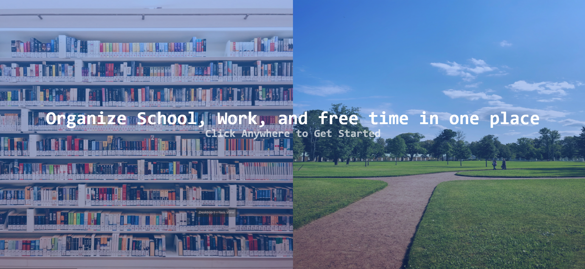
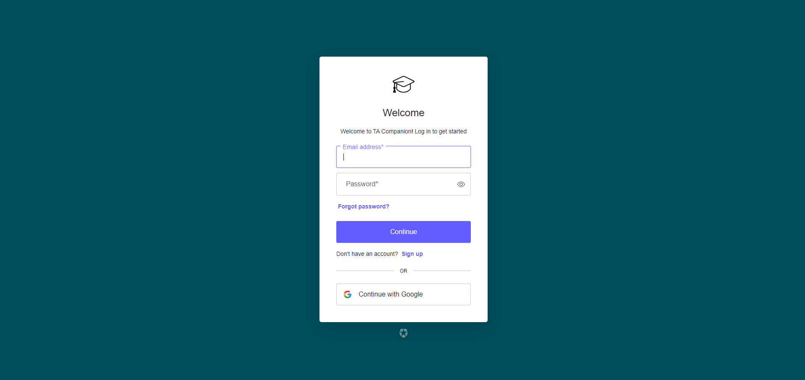
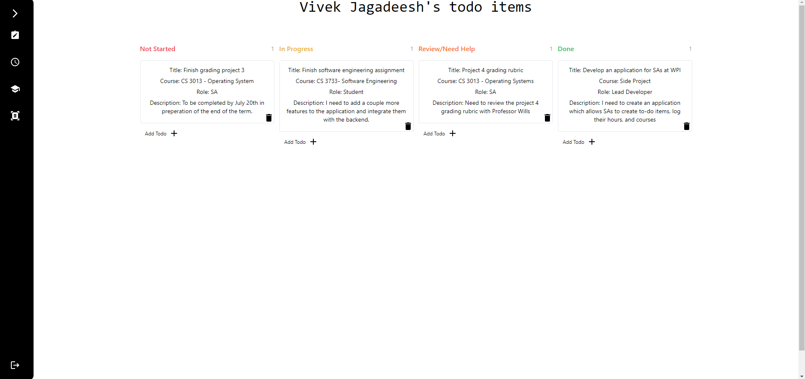
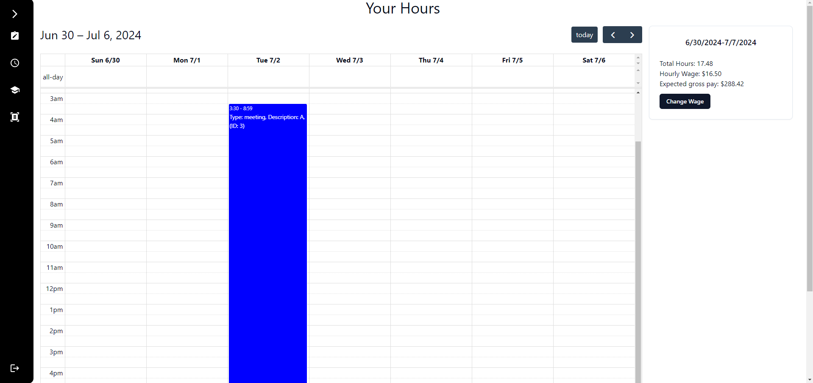
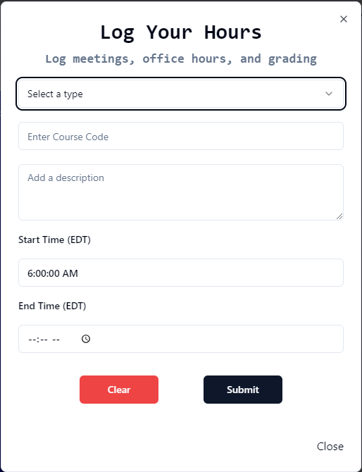
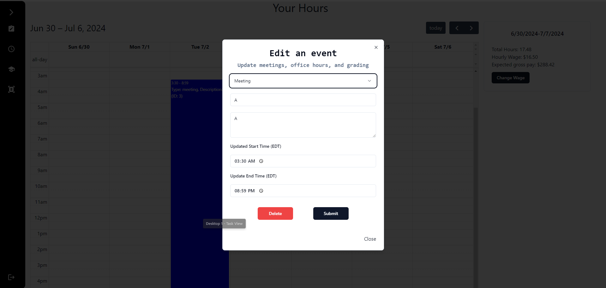
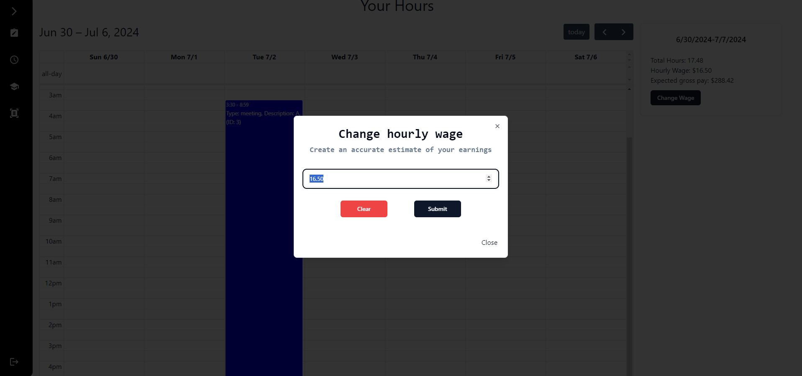
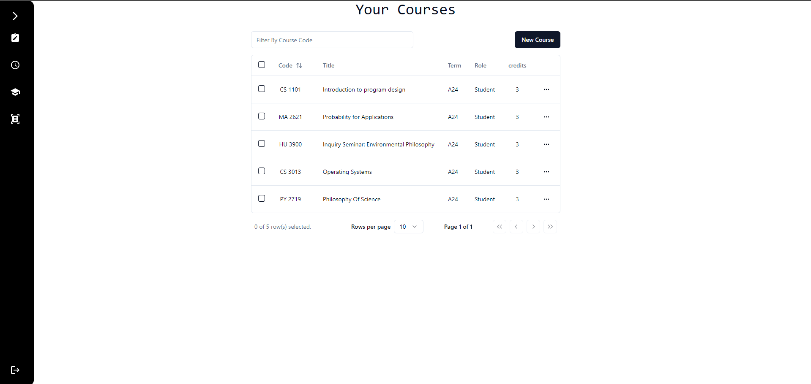
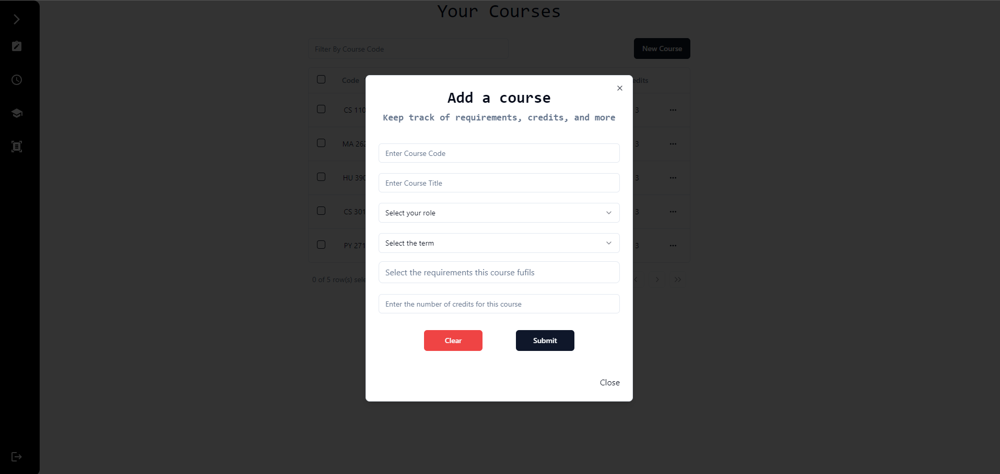
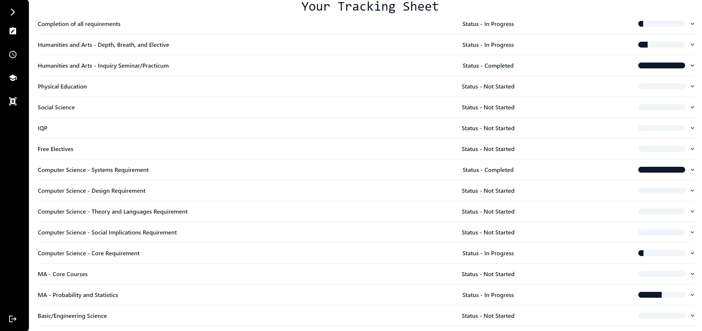

## TA Companion - An Application for Student Assistants at Worcester Polytechnic Institute, developed by Vivek Jagadeesh 

Note - Full documentation on the technology stack, and my experience developing this website can be found on my portfolio website at <a href="https://www.vivekjagadeesh.com/tacompanion">https://vivekjagadeesh.com</a>. The following documentation will cover how to use this software, rather than the process of developing this project.

<h2>Overview and Motivation</h2>

    This application was designed to centralize features from other applications (like Workday, Microsoft To-Do, WPI Planner, etc.) into a single application. 
    While serving as a student assistant for CS 3013 - Operating Systems at WPI recently,  I found that the features which I used on a daily basis were either de-centralized, 
    poorly designed, or non-functional. This led me to design TA Companion - an open source application which has the following features in one single web application. 

<ul>
<li> A Kanban Todo System which allows users to group their todo items by course, and role (TA vs student). </li>
<li> A system for logging hours, complete with a warning if the user tries to log more than 10 hours in a single week. </li>
<li> A system for creating, reading, updating, and deleting the classes taken, and taught at Worcester Polytechnic Institute </li>
<li> A system which allows users to visualize their degree progress quickly and easily using the courses created in the previous feature</li>
</ul>
Each of these features were motivated by my experience as an SA and similar experiences from classmates at WPI, and provide a single application for student-workers to manage their academics, job, and free time. 

<h2>Getting Started - Logging in</h2>

TA Companion utilizes user authentication to both secure user data and to provide an experience tailored to each particular user. Users can either create an account specific to TACompanion, or sign in with Google. 

<h2>Using the Kanban todo System</h2>

To begin using the Kanban to-do system, simply click on any of the "Add Todo" markers at the bottom of the column which you would like to add a to-do item to. Be sure to assign the following attributes to the to-do item you wish to create: 

<ul>
    <li>The Title of your new todo item - this is a brief name that can be used to easily recall the general idea of the task which needs to be completed</li>
    <li>The corresponding course -  this is the course(s) which the item belongs to. Example - CS 3013</li>
    <li>The description of the todo item - this is an extended description which provides additional context for the task that needs to be completed</li>
    <li>Your role in completing this todo - This is either SA, TA, GLA, or student, and helps you keep track of your work obligations and academic obligations</li>
</ul>

<h2>Logging your hours</h2>

To begin logging hours using TA Companion, click on the cell where your event begins. For example, if you have an event which starts on Wednesday, July 3rd at 10AM, you can begin logging this hour by clicking in the cell marked 10AM in the 7/3 column. At this point you will be created with the following form:

After you add the information to this form, your new hour will appear on the calendar.

Hours can be edited in the following ways 
1. Clicking on an hour will open a new popup allowing you to edit a particular event (see image)

2. The start and end time of an event can be changed by dragging/shrinking the top and bottom of the item on the calendar. This will alter the start/end time accordingly and persist the changes in the MongoDB database. 
3. To change the day of an event, simply drag and drop the calendar event to a different day. Like the last feature, this change will also exist in the database, and thus, the data will be persisted. 
4. An event can be deleted (permanently) by opening its edit modal (click on the event) and then clicking delete(see earlier picture)

In addition to creating, reading, updating, and deleting hours, this page may also be used to calculate a pre-tax income from each week. To change the hourly wage, click on the "change wage" button on the right hand size, and another modal (See below) will appear with the opportunity to enter a new wage

<h2>Creating, Reading, Updating, and Deleting Courses</h2>

TA Companion allows you to keep records of the courses you've taken and taught, and stores records in the MongoDB backend. 
To get create a course, click on the 'New Course' button in the top right hand corner. This will open the below form: 

After creating a course, a record can be updated by clicking the three dots to the right of any row in the table, and then clicking 'Edit Course Details'. At this point, another form will appear, allowing the user to change the details of their new course. 
Additionally, users can delete a course in one of two ways 
1. By using the 'remove course' option in the menu to the side of each row. 
2. By using the 'edit course' option in the menu to the side of each row and then clicking delete course on the popup. 

Finally, courses can be searched by <strong>course code</strong> using the paginated table

<h2>Viewing your degree progress</h2>

The final feature of the website allows you to view your progress in completing a CS degree at WPI (as of July 2024). Since WPI does not have a public API for getting courses or degree requirements, this feature only works for CS majors, but can be adapted to different majors if need be. 
Each row has the following information
1. The name of the requirement 
2. The status of the requirement 
3. The percentage completed 
4. An extended description (view by unfolding accordion)
5. The courses which are being applied to a particular requirement (view by unfolding accordion)

Finally, TA Companion uses vercel CRON jobs to send an email reminder to log their hours to its users every friday at 12:00 AM. Users are fetched via Auth0 and all users will receive reminders 

<h2>Appendix - Running this project</h2>
To run this project, use the command <code>npm run dev</code> and navigate to https://localhost:3000/ to view the result. Please contact me with any questions you may have. 
